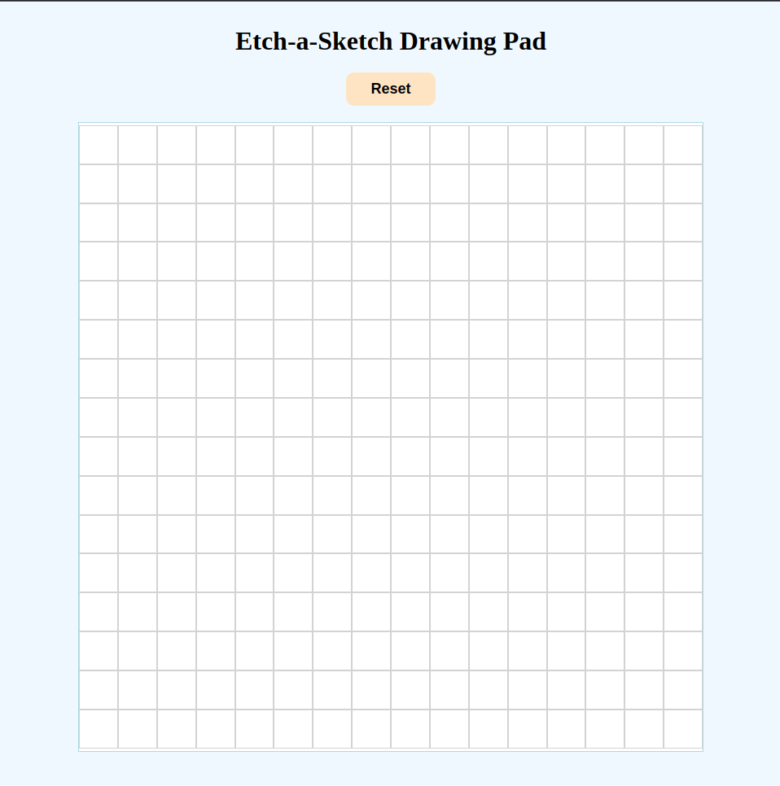
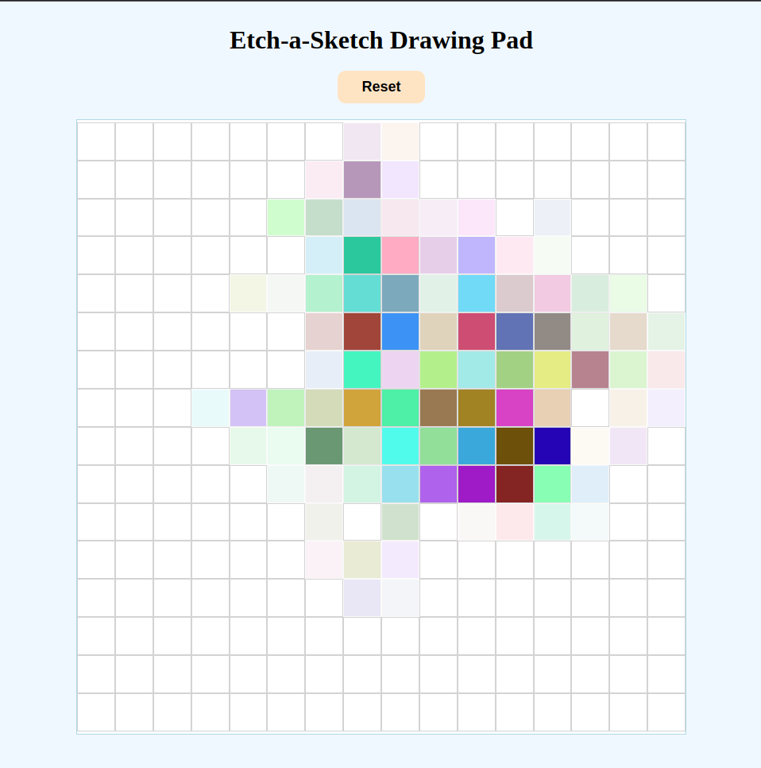

# Etch-a-Sketch

This is an interactive Etch-a-Sketch project where you can draw on a grid of squares by hovering your mouse over them. The squares change color when you hover over them, with the added feature of progressively darkening the squares with each interaction. The grid size can be customized by clicking the "Reset" button and entering a new size (max 100).


## Preview




## Features

- Draw on a customizable grid with mouse hover interactions.
- Grid size can be dynamically changed (up to 100x100).
- Squares progressively darken with each mouse interaction, reaching full black after 10 interactions.
- Randomized color effect for each square on hover (optional challenge).

## Demo

Check out the live demo here: [https://etch-a-sketch-one-chi.vercel.app/]


## How to Use

1. **Hover over the squares**: As you move your mouse over the grid, the squares will change color.
2. **Change the grid size**: Click on the "Reset" button and enter the number of squares you want per side (maximum of 100).
3. **Progressive darkening**: The squares will progressively darken with each hover interaction until they become completely black.

## Technologies Used

- **HTML**: Structure of the grid and button elements.
- **CSS**: Styling for the grid layout, button, and hover effects.
- **JavaScript**: Logic for creating the grid, adding the hover effects, and handling user inputs for grid size changes.

## Installation

1. Clone the repository to your local machine:
   ```bash
   git clone https://github.com/HM-Jubaer/Etch-a-Sketch.git
